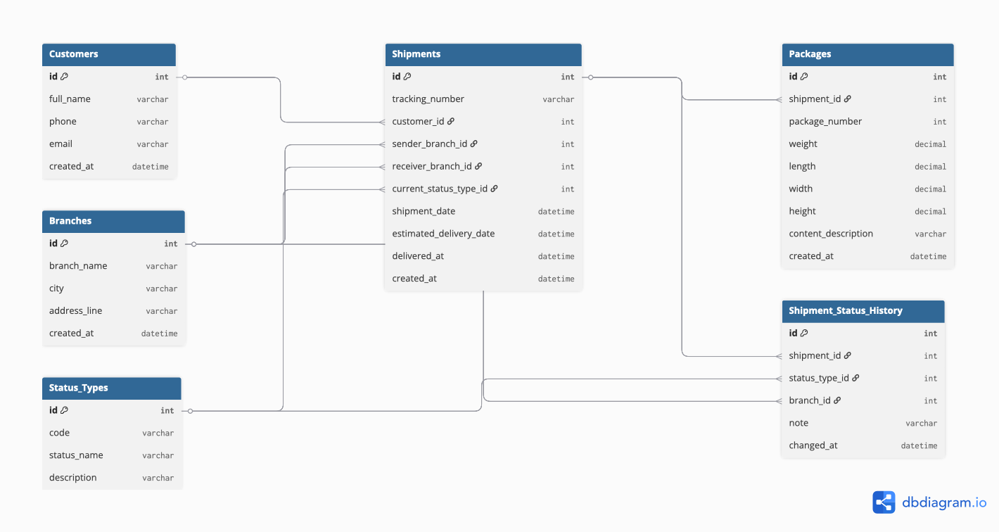

# CargoDB

CargoDB is a MySQL-based cargo shipment tracking database project.

## Project Structure

The database is created step by step using the following SQL scripts:

1. 01_create_database.sql
2. 02_create_tables.sql
3. 03_seed_data.sql
4. 04_procedures.sql
5. 05_views.sql
6. 06_indexes.sql
7. 07_sample_queries.sql

## Features

- Customer management
- Branch management
- Shipment tracking
- Package tracking
- Shipment status history
- Stored procedures for shipment operations
- Database views for reporting
- Index optimization

## Technologies

- MySQL
- SQL
- Stored Procedures
- Database Views

## Purpose

This project was created as a database design and SQL practice project to simulate a real-world cargo tracking system.

## Database ER Diagram

